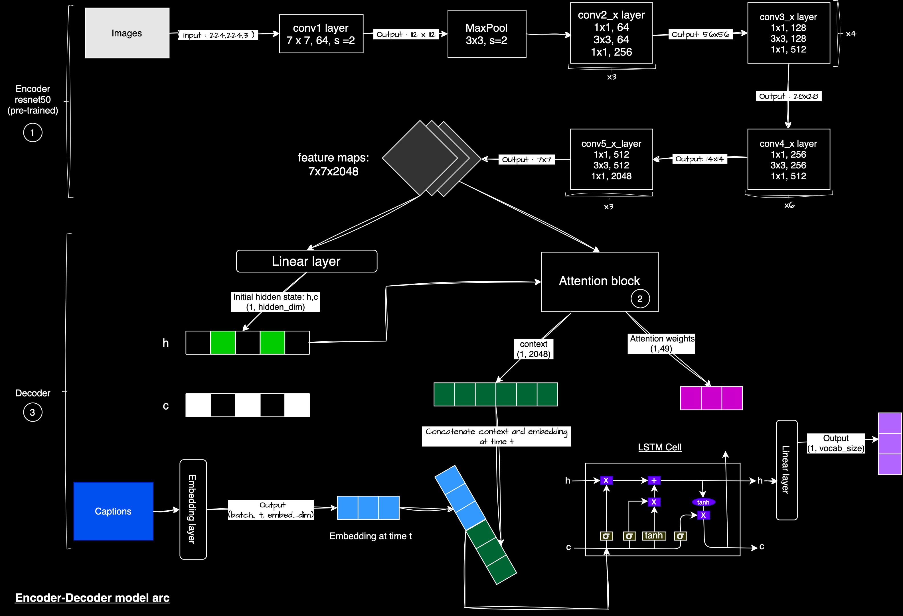
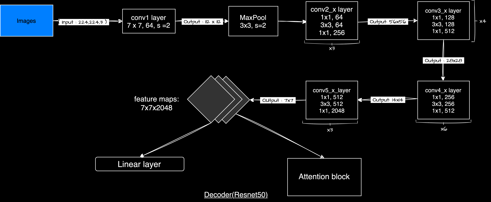
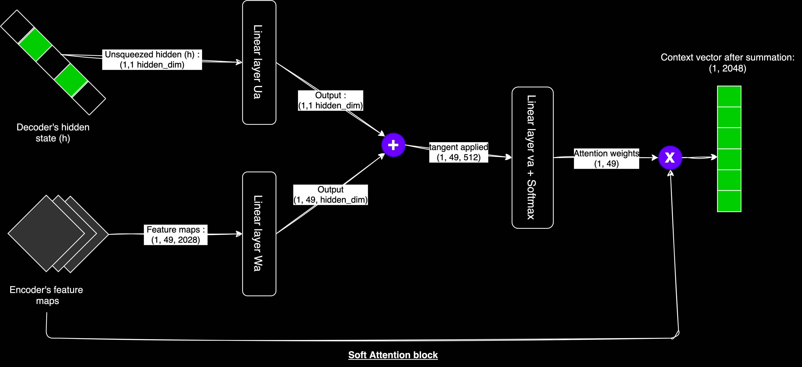
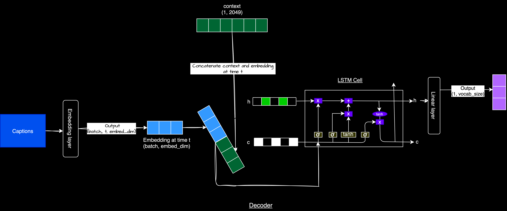

# image captioningggg 🐳

> [!NOTE]
>  
> ... wanted to understand more about cnn, lstm and attention.
> 
> ... this is why i decided to build image-captioning model.
> 
> ... image -> image-cap-model -> caption. 
>


<p align="center">
  
</p>


<p> caption : a person peacefully lies in a sunlit, flower-filled meadow surrounded by a serene forest, reminiscent of Studio Ghibli's enchanting landscapes.</p>

> note : this caption was gen by gpt.(ik i should go with latest models but i just i wanted build with this and definetly in future will build with new models).


# introduction 

- the image-caption-model will do the one simple thing.

- you input the image in model and it generate captions(basically described the image).

- it is like a langauage translation, in translation u input a text in one langauage and it convert it to another langauage.

- instead of langauage we have image that get converted into captions.

- to buiild i am sticking with cnn+lstm+attention arc and flickr8k dataset.


## Dataset 

**Flickr8k**

- it has around 8k images with it's corresponding captions.

- but im using only 5k.

### Data Loader 

- this what a pre-precessing looks a like.

**Code-Data_loader**

```python 
class ImageCaptionDataset(Dataset):
    def __init__(self, root_dir, captions_file, tokenizer, transform=None):
        self.root_dir = root_dir
        self.captions_file = pd.read_csv(captions_file)
        self.tokenizer = tokenizer
        self.transform = transform

    def __len__(self):
        return len(self.captions_file)

    def __getitem__(self, idx):
        img_name = self.captions_file.iloc[idx, 0]
        caption = self.captions_file.iloc[idx, 1]

        img_path = f"{self.root_dir}/{img_name}"
        image = Image.open(img_path).convert("RGB")

        if self.transform is not None:
            image = self.transform(image)

        # Tokenize the caption
        caption_tokens = self.tokenizer(caption, padding='max_length', max_length=30, truncation=True, return_tensors="pt")
        caption_tensor = caption_tokens['input_ids'].squeeze()  # Remove extra dimension

        return image, caption_tensor
```

- the repo i refer used spacy for tokenization(kinda old).

- i updated with bert tokenizer.(due to it i need to change some code in model.py, train.py and inference.py).

- for images everything stays same(tranform -> didnt used flip or normalize).

- then added some paading with `custom_collate_fn` function. 

## Architecture

> [!IMPORTANT]
>
> Encoder(resnet50) -> hels in extracting the features(info) from the images.
>
> Attention(block) -> helps in focusing on imp parts of images w.r.t captions.
>
> Decoder(lstms) -> gen captions for the given image features.




**Input Flow in short:**

1. Image → EncoderCNN -> Image Features

2. Image Features -> Initialize Decoder States

3. for each word position: 

   - Previous Word (or start token) -> Word Embedding
   
   - Current Hidden State + Image Features -> Attention -> Context Vector
   
   - Word Embedding + Context Vector -> LSTM Cell -> Updated Hidden State
   
   - Updated Hidden State -> Fully Connected Layer -> Word Prediction


repeat step 3 until end token is predicted or maximum length is reached.

> i used the baseline arc from the [udacity course on computer vision](https://github.com/koles289/udacity-Image-Captioning)

# EncoderCNN: 

### Overview

It uses a pre-trained [ResNet-50](https://github.com/saurabhaloneai/History-of-Deep-Learning/blob/main/02-optimization-and-regularization/03-residuals/resnet.ipynb) to extract features from images. these features are then passed to the decoder, which generates captions.



**Code-Encoder**

```python
class EncoderCNN(nn.Module):
    def __init__(self):
        super().__init__()
        resnet = models.resnet50(pretrained=True)
        # freeze resnet parameters to prevent updating during training
        for param in resnet.parameters():
            param.requires_grad_(False)
        
        modules = list(resnet.children())[:-2]
        self.resnet = nn.Sequential(*modules)

    def forward(self, images):
        features = self.resnet(images)                                   
        # reshape features for attention
        features = features.permute(0, 2, 3, 1)                          
        features = features.view(features.size(0), -1, features.size(-1)) 
        return features
```

- the EncoderCNN uses a ResNet-50 model that has been pre-trained on the ImageNet dataset.

- why pretrained cuase it already train on large dataset due it faster converge and improve performance on specific tasks with limited data.

```python
resnet = models.resnet50(pretrained=True)
``` 


- we freeze its parameters so they don't change during training.(cuase we are not trianing it, we only do the forward pass)

- this way, ResNet-50 can focus on extracting useful features from the input images.

```python
for param in resnet.parameters():
            param.requires_grad_(False)
```

- after that we remove the last layers of ResNet-50, which are designed for classification, because we only need the feature maps, not the classification output.

```python 
 modules = list(resnet.children())[:-2]
```

### forward pass

**Input**

- the input(images) with shape `(batch_size, 3, 224, 224)`. 

- 224x224 is the image size, and 3 is for the RGB color channels.

**Passing Through ResNet-50**

- After passing, the feature map shape is `(batch_size, 2048, 7, 7)`. 

- 2048 is the number of features, and 7x7 is the reduced spatial size of the image.

```python 
features = self.resnet(images)  
```

**Reshaping for Attention** 

- we then rearrange the dimensions so the spatial information comes first. 

- after permuting, the shape is `(batch_size, 7, 7, 2048)`.

- then we flatten the spatial dimensions ton so we can fed to attn.

- the output shape becomes `(batch_size, 49, 2048)`. `49` is `7x7`, and `2048` is the number of features.

```python 
features = features.permute(0, 2, 3, 1)                          
features = features.view(features.size(0), -1, features.size(-1))
```

- the final output is a feature tensor with shape `(batch_size, num_features, encoder_dim)`, which is passed to the decoder.

> but why cnn based resnet work ? read more [here](https://end-to-end-machine-learning.teachable.com/courses/321-convolutional-neural-networks/lectures/14555482).

# Attention: 

### Overview


> what is attention ?

- Attention is a mechanism that allows the model to selectively focus on the most relevant parts of the input (image features) 
when generating each output (word in the caption).

- it calculates attention scores that tell the model which parts of the image to pay more attention to at each step in the caption gen process.



**Code-Attention**

```python
class Attention(nn.Module):
    def __init__(self, encoder_dim, decoder_dim, attention_dim):
        super().__init__()
        self.attention_dim = attention_dim
        # linear layers for attention
        self.W = nn.Linear(decoder_dim, attention_dim)
        self.U = nn.Linear(encoder_dim, attention_dim)
        self.A = nn.Linear(attention_dim, 1)

    def forward(self, features, hidden_state):
        u_hs = self.U(features)     
        w_ah = self.W(hidden_state) 
        combined_states = torch.tanh(u_hs + w_ah.unsqueeze(1)) 
        attention_scores = self.A(combined_states)        
        attention_scores = attention_scores.squeeze(2)    
        alpha = F.softmax(attention_scores, dim=1)    # attention_weight      
        # apply attention weights to features
        attention_weights = features * alpha.unsqueeze(2)  
        attention_weights = attention_weights.sum(dim=1)  
        return alpha, attention_weights

```

- the Atten uses three linear layers.(it uses this to cal attention scores.) 

- **self.W**: takes the hidden state of the decoder `(decoder_dim)` and maps it to the attention space `(attention_dim)`.

- **self.U**: takes the features from the encoder `(encoder_dim)` and also maps them to the attention space `(attention_dim)`.

- **self.A**: reduces the combined attention space to a single value -> attention_score.

```python 
self.W = nn.Linear(decoder_dim, attention_dim)
self.U = nn.Linear(encoder_dim, attention_dim)
self.A = nn.Linear(attention_dim, 1)
```


### Forward Pass

**Input**

- the attention mechanism takes two inputs: the image features `(encoder output)` and the current hidden state of the decoder.

- the image features have a shape of (batch_size, 49, encoder_dim) -> `49` is the flattened dim of the feature maps, and the hidden state has a shape of (batch_size, decoder_dim).

```python 
def forward(self, features, hidden_state):
```

**computation**

- first the image features `(features)` and the decoder hidden state `(hidden_state)`are passed through the linear layer using the `self.U` 
and `self.W` layers, respectively, to produce u_hs and w_ah of shape `(batch_size, 49, attention_dim)`

```python 
u_hs = self.U(features)     
w_ah = self.W(hidden_state)
```

- we `w_ah.unsqueeze(1)` cuase w_ah has shape (batch_size, attention_dim), we use .unsqueeze(1) to add an extra dimension so it can be added to u_hs.

- after passing through linear layer the features and hidden state are combined using element-wise addition and 
passed through the tanh activation function to produce combined_states of shape `(batch_size, 49, attention_dim)`.

- the combined_states are then passed through the self.A linear layer to calculate the 'attention scores` - > shape `(batch_size, 49, 1)`

- then we squeezed to remove the singleton dimension to convert it to -> (batch_size, 49)


```python 
combined_states = torch.tanh(u_hs + w_ah.unsqueeze(1)) # combined 
attention_scores = self.A(combined_states)             # self.A
attention_scores = attention_scores.squeeze(2)         # remove (batch_size, 49,`1`)
```

**Softmax** 

- the attention scores are passed through a softmax function to normalize them into probabilities.

- the attention scores are then passed through the softmax function along the feature dimension to compute the attention weights (alpha), 
which represent the relevance of each feature for the current decoder hidden state.

> Calculation of atten_score in detail :

- Attention scores atten_score are calculated using the feed-forward network (notations can vary depending on the source and differ from the original paper):

$score_{ij} = v_a^T \tanh(U_a h_{t-1} + W_a h_j)$

- where:

  - h_{t-1}: Decoder's hidden state at time t-1
  - h_j: Encoder's output (feature maps)
  - U_a, W_a: Learnable parameter matrices
  - v_a: Learnable parameter vector


- attention weights atten_weights are computed by applying softmax to the attention scores:

$$\alpha_{ij} = \frac{\exp(score_{ij})}{\sum_k \exp(score_{ik})}$$

- The context vector c_t is the weighted sum of the encoder output features:

$$c_t = \sum_j \alpha_{ij} h_j$$

```python
alpha = F.softmax(attention_scores, dim=1) 
```

- alpha are used to apply a weighted sum of the image features. 

- and also we need unsqueezed to match the feature dimension -> shape (batch_size, 49, 1).

- alpha are multiplied element-wise with the image features resulting ->  attention_weights of shape (batch_size, 49, encoder_dim).

- alpha are then summed along the feature dimension to produce the attention context -> shape of (batch_size, encoder_dim).

```python
# apply attention weights to features
attention_weights = features * alpha.unsqueeze(2)  
attention_weights = attention_weights.sum(dim=1)
```

**Output**

- the attention class returns two things:

  - alpha: the attention weights, which show where the model is focusing its attention.
  
  - attention_weights: the context vector, which combines the encoder features according to the attention weights.

```python
return alpha, attention_weights
```
- read more about attention [here](https://lilianweng.github.io/posts/2018-06-24-attention/)


# DecoderRNN: 

### Overview

- the DecoderRNN gen captions for the given image features. 

- it takes the attention-weighted context vectors from the Attn class and the pre-gen word to produce the next word in the sequence. 

- it uses an LSTM (Long Short-Term Memory) to handle the text data(captions).

- lets formalize this in terms of math : 
 
 - the input image features X (extracted by the EncoderCNN) and target captions Y with length T, the model learns to predict the sequence Y, computing the probability P(Y|X).




**Code-Decoder**

```python
class DecoderRNN(nn.Module):
    def __init__(self, embed_size, attention_dim, encoder_dim, decoder_dim, drop_prob=0.3):
        super().__init__()
        self.attention = Attention(encoder_dim, decoder_dim, attention_dim)
        # embedding layer using bert tokenizer vocabulary
        self.embedding = nn.Embedding(len(BertTokenizer.from_pretrained('bert-base-uncased')), embed_size)
        # initialize hidden and cell states
        self.init_h = nn.Linear(encoder_dim, decoder_dim)  
        self.init_c = nn.Linear(encoder_dim, decoder_dim)  
        # lstm cell for sequence generation
        self.lstm_cell = nn.LSTMCell(embed_size + encoder_dim, decoder_dim, bias=True)
        # fc layer for output
        self.fcn = nn.Linear(decoder_dim, self.embedding.num_embeddings)

        self.drop = nn.Dropout(drop_prob)
    def forward(self, features, captions):
       embeds = self.embedding(captions)
       h, c = self.init_hidden_state(features)
       seq_length = captions.size(1) - 1 
       batch_size = captions.size(0)
       num_features = features.size(1)
       
       # initialize tensors to store predictions and attention weights
       preds = torch.zeros(batch_size, seq_length, self.embedding.num_embeddings).to(features.device)
       alphas = torch.zeros(batch_size, seq_length, num_features).to(features.device)
               
       # generate sequence
       for s in range(seq_length):
           alpha, context = self.attention(features, h)
           lstm_input = torch.cat((embeds[:, s], context), dim=1)
           h, c = self.lstm_cell(lstm_input, (h, c))
           output = self.fcn(self.drop(h))
           preds[:, s] = output
           alphas[:, s] = alpha  
       
       return preds, alphas
```

1. everthing start with encoder ->  image is passed through a ResNet50 -genrate-> feature map.

2.  encoder features are used to initialize the decoder's hidden and cell states.

```python 
h, c = self.init_hidden_state(features)
```

3. generates the caption word by word 

  - for each word : 
    
    -  a. attention computation : 
    ```python
    alpha, context = self.attention(features, h)
    ```
    - lstm cell current hidden state and image features to compute attention weights and a context vector
  
    - b. input for lstm cell 
  
    ```python
    lstm_input = torch.cat((embeds[:, s], context), dim=1)
    ```
    - we need to concatenating the embedding of the previous word (or start token for the first word) with the context vector to get input fot lstm-cell.
  
    
    - c. lstm cell 
  
    ```python 
    h, c = self.lstm_cell(lstm_input, (h, c))
    ```
    
    -  it processes the input and update the hidden and cell states
  
  
    - d. output 
  
    ```python
    output = self.fcn(self.drop(h))
    ```
  
    - updated hidden state is passed through a dropout layer and a fully connected layer to generate logits for the next word
  
  
    - e. storing 
  
    ```python
    preds[:, s] = output
    alphas[:, s] = alpha 
    ```
    - output and attention weights are stored for each time step.
  
  
    - Each word of the caption is embedded and used as input for the next time step. This is known as teacher forcing.
    
4. then for trainig the actual output will be used :

```python 
embeds = self.embedding(captions)
```

- each word of the caption is embedded and used as input for the next time step.

5. output :

```python
return preds, alphas
```
- model returns the predictions and attention weights for the entire sequence:

why lstm for text read more [here](http://karpathy.github.io/2015/05/21/rnn-effectiveness/).


# The Complete Story 

> class EncoderCNN

- It uses a pre-trained ResNet50 model.

-  parameters are frozen to use the pre-trained weights.
- last two layers of ResNet are removed to get feature maps instead of classification output.
- reshapes the output for attention mechanism (flattening spatial dimensions).

> Attention class:

-  we used Bahdanau attention.

- It perform three linear layers to transform encoder features, decoder state, and combine them.
- transforms features and hidden state.
- combines them and applies tanh activation.
- calculates attention scores and softmax to get attention weights.
- applies attention weights to features to get the context vector.

> DecoderRNN class:

- init Attention module.

- uses BERT tokenizer vocabulary for word embedding.
- initi layers for hidden and cell states.
- sets up LSTM cell and output layer.
- for each word in the sequence:

  - calculates attention and context.
  - feeds embedding and context to LSTM.
  -  generates output probabilities.
  - stores predictions and attention weights.

> EncoderDecoder class(last)

- Init both encoder and decoder.

- in the forward pass:
  - encodes images to features.
  - decodes features to generate captions.


# Training 

- i trained on two t4 gpus from kaggle 

- hyperparamters : 

```pyhton 
   embed_size=300
   attention_dim=256
   encoder_dim=2048
   decoder_dim=512
   learning_rate = 3e-4
   batch = 32
   epochs = 100
```

- optim -> Adam and loss_fn - > CrossEntropyLoss.

```python 

criterion = nn.CrossEntropyLoss(ignore_index=tokenizer.pad_token_id)
optimizer = optim.Adam(model.parameters(), lr=learning_rate)

```

- dropout = 0.4/0.5 

- didn't used any standard accuracy metric like BLEU score.

- the model got overfit -> curr i am training with few new addition to code like increasing dropout, learning_rate_shedular and gradietn clipping.


# Inference 

- i waste lots of time here.(i was trying to add beam search -> in the end i did not implement it)

- so there is two algo that i can implement to have the good ouptut result ex. greedy search or beam search 

- short explantion of both : -> greedy search -> at each step choose the word with the highest probability. and beam search -> maintains top-k most probable sequences at each step. 

- may be in future i will try this out 


# heyyyyyyyyyyyyy hi 🐳 

> [!NOTE]
>
> ... tbh i enjoyed building this and yeah will be building more stuff like this in future.
> 
> ... i learned lots stuff while building by this ( all u need is good codebases, articles and papers.)
>
> ... but it was worth it.
> 
> ... rn i don't have any plan to improve this so this it.
>
> ... next goal will be to build image-cap with GPT2 and ViT and then with CLIP.
> 
> ... bye bye bye 🐳 !!! 


# Reference 

[1] Kelvin Xu, Jimmy Lei Ba, Ryan Kiros, Kyunghyun Cho, Aaron Courville, Ruslan Salakhutdinov, Richard S. Zemel, Yoshua Bengio. (April 19 2016). Show, Attend and Tell: Neural Image Caption Generation with Visual Attention.

[2] Andrej Karpathy. (May 21 2105). The Unreasonable Effectiveness of Recurrent Neural Networks.

[3] Lilian Weng. (June 24, 2018). Attention? Attention!

[4] Sagar Vinodababu. A PyTorch Tutorial to Image Captioning.

[5] Image Captioning with Attention by Artyom Makarov.

[6] PyTorch DataLoader: Understand and implement custom collate function by Fabrizio Damicelli

[7] Pytorch Image Captioning Tutorial(wihtout attention) by Aladdin Persson

